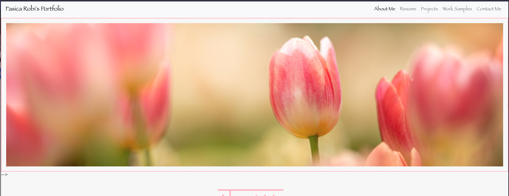
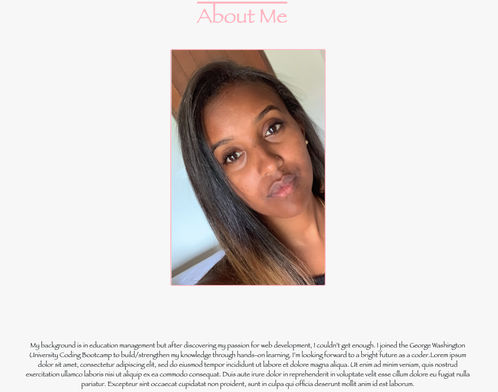
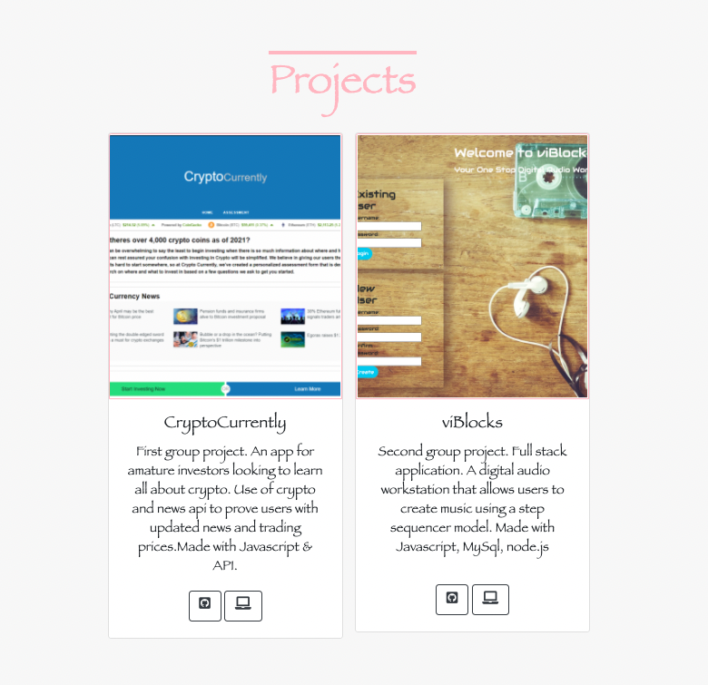
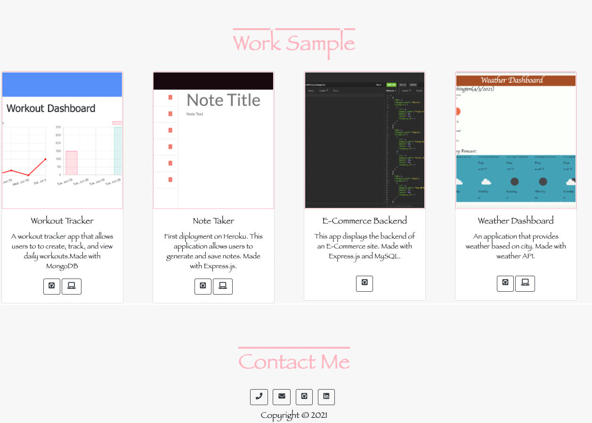

# Updated Portfolio

An updated portfolio created with HTML, CSS, and Bootstrap. This application now highlights the project 2 along with other fun applications I have been working on.

## Application Display  

* Application: https://fasicasr.github.io/updated-portfolio/index.html
* Github: https://github.com/fasicasr/updated-portfolio

# Highlights 

* Use the navbar to manuver throughout the webpage and to get a downloadable pdf of resume.
* Go to the "about me" section to learn about my background.
* Scroll down or use navbar to browse through the porfolio section, where you can find screenshots of projects/homework along with links to the application and the source code on github.
* Go to the resume section to preview and/or download my rume  
* Finally head to the bottom of the screen to get in contact with me via email, github and/or linkedin.

# Webpage Display 

Intro:

About Me:

Projects:

Work Sample and Contact Me:

# Collaborators

CryptoCurrently
* Maria Guerrero - Github: mjquerrero
* Sam Garcia - Github: sam25188
* Sana Chowdhury - Github: sanawck
* Fasica Robi - Github: fasicasr

ViBlocks
* Forest Wilson Github: ForestW70 
* Dmitry Balduev Github: dmitrybalduev 
* Sallieu Kanu Github: salmankanu 

# Questions

* Github: https://github.com/fasicasr
* Email: Fasicasr@gmail.com

## License

Copyright © 2021 
